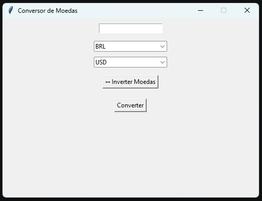

# Conversor de Moedas

Aplicação desktop desenvolvida em Python utilizando Tkinter e uma API de câmbio em tempo real.

## Funcionalidades

- Conversão de moedas em tempo real
- Atualização automática das cotações
- Inversão rápida de moedas
- Tratamento de erros de conexão
- Interface gráfica amigável

## Tecnologias

- Python
- Tkinter
- Requests
- API Exchange Rates

## Interface



## Instalação

```bash
pip install -r requirements.txt
```

## Como executar

pip install -r requirements.txt

python main.py